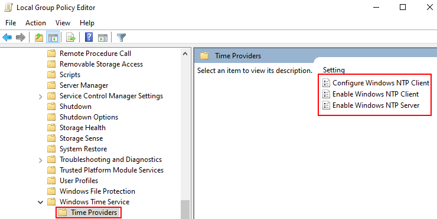
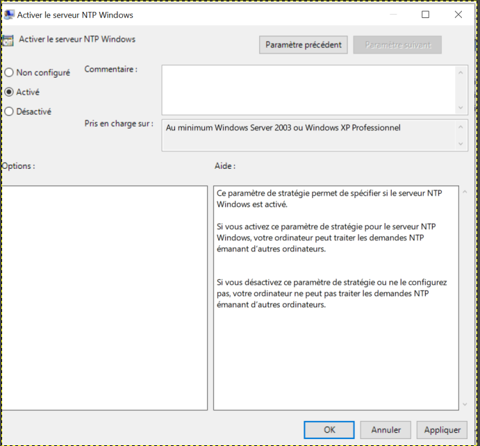

# Win32tm

## Configure as client

```
C:\Windows\system32\w32tm /config /manualpeerlist:"10.0.5.10,0x8 ie.pool.ntp.org,0x2" /syncfromflags:MANUAL /update /reliable:YES
C:\Windows\system32\w32tm /debug /enable /file:C:\w32tm.log
C:\Windows\system32\w32tm /resync /rediscover
C:\Windows\system32\w32tm /dumpreg /subkey:parameters
C:\Windows\system32\w32tm /query /status /verbose

Stop-Service w32time
Start-Service w32time

Set-Service –Name w32time –StartupType "Automatic"
```

## Configure as server

Navigate to **Computer** > **Administrative Templates** > **System** > **Windows Time Service** > **Time Providers** > **Enable Windows NTP Server**.




# FireWall

## Set

```
netsh advfirewall firewall add rule name="Open Port 123/UDP" dir=in action=allow protocol=UDP localport=123
```

# TimeZone

## List

```
tzutil /l
```

## Set

```
tzutil /s "W. Europe Standard Time"
Set-TimeZone -Id "W. Europe Standard Time"
```

# Sources
https://thegeekpage.com/the-computer-did-not-resync-because-no-time-data-was-available-error-in-windows-10/

https://woshub.com/how-to-set-timezone-from-command-prompt-in-windows/
https://superuser.com/questions/842698/how-to-open-a-firewall-port-in-windows-using-power-shell

https://www.ntppool.org/zone/ie

https://learn.microsoft.com/en-us/windows-server/networking/windows-time-service/windows-time-service-tools-and-settings?tabs=ntpserver

